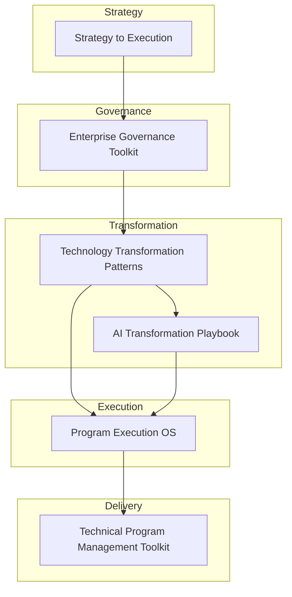
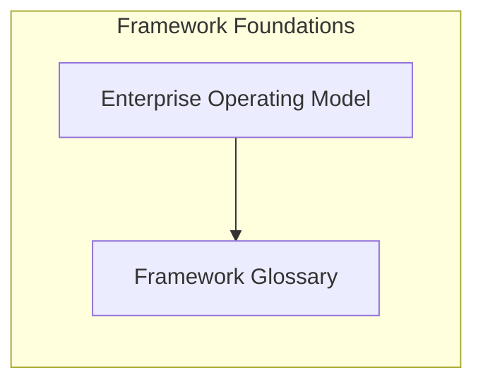

# Transformation Operating Framework

> **Author:** Somer Walker  
> Creator of the Transformation Operating Framework, a model for aligning strategy, governance, and program execution in complex organizations.

The **Transformation Operating Framework** provides a structured model for aligning strategy, governance, transformation initiatives, and execution across complex organizations.

Large organizations frequently struggle not because they lack strategic ideas, but because they lack a framework that connects leadership intent to coordinated operational execution.

This repository documents the conceptual architecture of the framework and links to supporting repositories that provide practical implementation guidance.

---

# Design Principles

The Transformation Operating Framework is built around several core principles:

• Strategy must be translated into executable initiatives  
• Governance must clarify decision authority and accountability  
• Programs must provide visibility into execution progress  
• Transformation initiatives must align with operating model capabilities  
• Delivery practices must enable coordination across teams

These principles guide how organizations structure transformation efforts across the framework.

---

# Transformation Operating Framework Model

Each layer addresses a specific challenge in organizational transformation and execution.

---

## Framework Foundations

Certain elements support the framework across all layers.

These foundational resources provide shared definitions and structural context used throughout the framework.

---

# Framework Architecture

The Transformation Operating Framework organizes enterprise transformation into several complementary layers.  
Each layer is documented in a dedicated repository that expands on the concepts and provides practical implementation guidance.

---

## Strategy Layer

Defines how organizations translate high-level strategic objectives into coordinated initiatives and execution plans.

Repository  
https://github.com/somerwalker/strategy-to-execution

---

## Governance Layer

Defines decision structures, leadership alignment mechanisms, and escalation models required to guide transformation initiatives.

Repository  
https://github.com/somerwalker/enterprise-governance-toolkit

---

## Transformation Layer

Documents recurring transformation patterns observed across organizations modernizing their technology platforms and operating models.

Repository  
https://github.com/somerwalker/technology-transformation-patterns

---

## Execution Layer

Defines structured approaches for coordinating complex programs and aligning cross-functional teams around delivery objectives.

Repository  
https://github.com/somerwalker/program-execution-os

---

## Delivery Layer

Provides practical artifacts used by technical program managers and delivery teams to manage initiatives and maintain execution discipline.

Repository  
https://github.com/somerwalker/technical-program-management-toolkit

---

## AI Transformation

A specialized transformation playbook focused on organizational adoption of AI capabilities.

Repository  
https://github.com/somerwalker/ai-transformation-playbook

---

## Supporting Resources

### Framework Glossary

Terminology and shared definitions used across the framework.

Repository  
https://github.com/somerwalker/framework-glossary

---

### Enterprise Operating Model

Defines broader organizational structures and operational capabilities that enable sustained transformation.

Repository  
https://github.com/somerwalker/enterprise-operating-model

---

# Why This Framework Exists

Many organizations struggle with execution gaps between strategy and delivery.

Common symptoms include:

- too many initiatives competing for resources  
- unclear decision authority  
- weak cross-team coordination  
- poor visibility into program progress  
- difficulty scaling transformation initiatives  

The Transformation Operating Framework introduces a structured approach for addressing these challenges and aligning leadership intent with coordinated execution.

---

# Who This Framework Is For

This framework is designed for:

- enterprise transformation leaders  
- program and portfolio leaders  
- technology executives  
- organizational change leaders  

## Intellectual Property

The frameworks and methodologies documented in this repository are original work created by Somer Walker as part of the **Transformation Operating Framework**.

This repository provides conceptual documentation, examples, and templates for educational and professional reference.

Commercial use of the methodology or derivative consulting frameworks requires written permission from the author.# Contributing

Contributions that improve documentation clarity, diagrams, examples, or explanations are welcome.

Please review the guidelines in `CONTRIBUTING.md` before submitting updates.

## Author

Somer Walker  
Enterprise Program Leader | AI Transformation | Operational Excellence

Background leading complex infrastructure, cloud, and AI initiatives across global organizations focused on turning strategy into disciplined execution.

LinkedIn  
https://www.linkedin.com/in/somerwalker

## Contributing

Suggestions, improvements, and additional examples are welcome.  
Please review `CONTRIBUTING.md` before submitting a pull request.

## Copyright

Copyright © 2026 Somer Walker

All rights reserved.

This repository documents the Transformation Operating Framework and associated methodologies.

Commercial use of the framework or derivative consulting materials requires written permission from the author.
