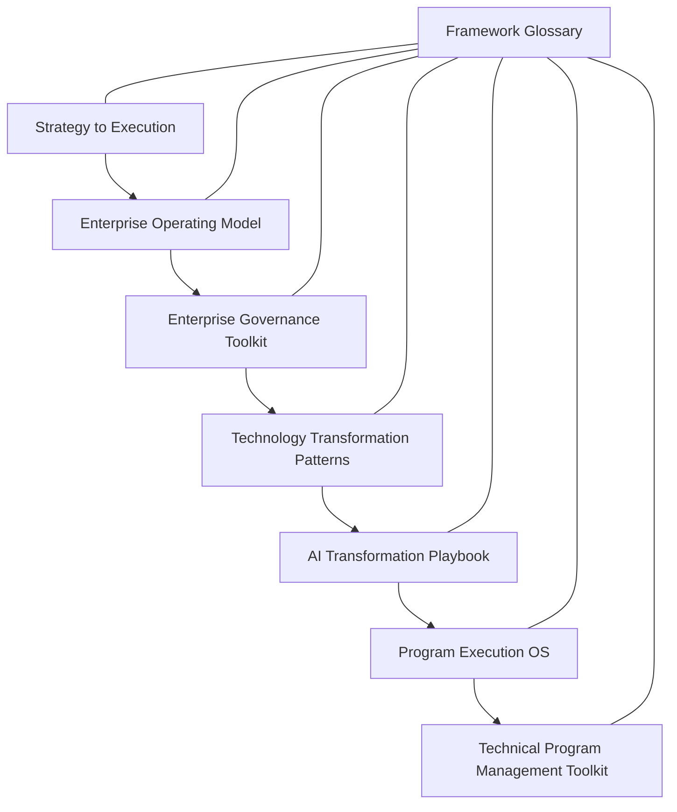

# Transformation Operating Framework

A structured operating framework for translating strategy into coordinated execution across organizations.

Large organizations frequently struggle not because they lack strategic ideas, but because they lack a framework that connects strategy, governance, transformation initiatives, and delivery execution.

The Transformation Operating Framework introduces a layered model for aligning leadership intent with operational execution.

---

## Transformation Operating Framework Model

Each layer addresses a specific challenge in organizational execution.

---

## Framework Components

The Transformation Operating Framework is supported by several repositories that describe the frameworks used at each layer.

### Strategy Layer

Defines how organizations translate high-level strategic objectives into coordinated initiatives.

Repository:

https://github.com/somerwalker/strategy-to-execution

---

### Governance Layer

Defines decision structures, leadership alignment, and escalation models required to guide transformation initiatives.

Repository:

https://github.com/somerwalker/enterprise-governance-toolkit

---

### Transformation Layer

Documents common transformation patterns observed across organizations.

Repository:

https://github.com/somerwalker/technology-transformation-patterns

---

### Execution Layer

Defines structured approaches for coordinating complex programs.

Repository:

https://github.com/somerwalker/program-execution-os

---

### Delivery Layer

Provides practical artifacts used by technical program managers and delivery teams.

Repository:

https://github.com/somerwalker/technical-program-management-toolkit

---

### AI Transformation

A specialized transformation playbook focused on AI initiatives.

Repository:

https://github.com/somerwalker/ai-transformation-playbook

---

## Why This Framework Exists

Many organizations struggle with execution gaps between strategy and delivery.

Common symptoms include:

- too many initiatives competing for resources  
- unclear decision authority  
- weak cross-team coordination  
- poor visibility into program progress  
- difficulty scaling transformation initiatives  

The Transformation Operating Framework introduces a structured approach for addressing these challenges.

---

## Who This Framework Is For

This framework is designed for:

- enterprise transformation leaders  
- program and portfolio leaders  
- technology executives  
- organizational change leaders  

---

## Contributing

Contributions are welcome. Please review the guidelines in `CONTRIBUTING.md` before submitting improvements or examples.

---

## Author

Somer Walker  
Enterprise Program Leader | AI Transformation | Operational Excellence

Original creator of the Enterprise Transformation Framework and
associated methodologies documented in this repository.

Background leading complex infrastructure, cloud, and AI initiatives across global organizations focused on turning strategy into disciplined execution.

LinkedIn  
https://www.linkedin.com/in/somerwalker

---
© 2026 Somer Walker  
Enterprise Transformation Framework

This framework and its associated documentation are shared for educational and professional reference. Attribution is appreciated when referencing or adapting these materials.
