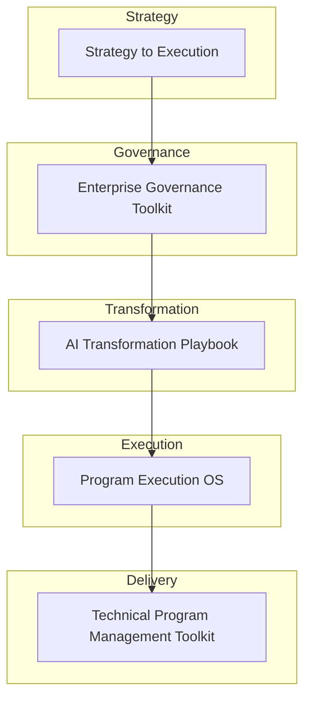

# Transformation Operating Framework

A practical framework for translating organizational strategy into coordinated execution across programs, teams, and technology initiatives.

Organizations frequently struggle not because they lack strategic ideas, but because they lack structured operations systems for execution.

This repository connects a set of practical frameworks designed to help organizations move from strategy to measurable outcomes.

---

## Transformation Architecture

This model represents the lifecycle of enterprise execution:

Strategy → Governance → Transformation → Execution → Delivery

---

## Framework Components

### Strategy to Execution
Framework for translating strategic goals into coordinated initiatives.

Repository  
https://github.com/somerwalker/strategy-to-execution

---

### Enterprise Governance Toolkit
Structures for decision-making, escalation, and leadership alignment.

Repository  
https://github.com/somerwalker/enterprise-governance-toolkit

---

### AI Transformation Playbook
Operating model for implementing AI initiatives responsibly and effectively.

Repository  
https://github.com/somerwalker/ai-transformation-playbook

---

### Program Execution OS
Framework for coordinating complex programs across teams and stakeholders.

Repository  
https://github.com/somerwalker/program-execution-os

---

### Technical Program Management Toolkit
Practical templates and artifacts used by technical program leaders.

Repository  
https://github.com/somerwalker/technical-program-management-toolkit

---

## Repository Contents

| File | Description |
|-----|-------------|
| docs/1-framework-overview.md | Explanation of the Transformation Operating Framework and its execution layers |

---

## Why This Framework Exists

Organizations frequently face challenges when translating strategy into execution:

- competing priorities  
- unclear decision authority  
- misaligned teams  
- weak program coordination  
- limited visibility into outcomes  

The Transformation Operating Framework provides a structured model connecting strategy, governance, transformation programs, and delivery execution.

---

## Contributing

Contributions and suggestions are welcome. Please review the guidelines in `CONTRIBUTING.md` before submitting improvements or examples.

---

## Author

**Somer Walker**  
Enterprise Program Leader | AI Transformation | Operational Excellence  

LinkedIn  
https://www.linkedin.com/in/somerwalker
